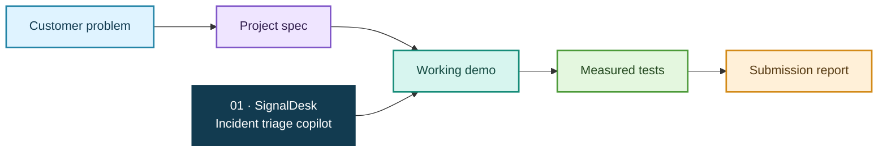

# FDE Projects

> A practical portfolio of customer-facing engineering projects: from a messy workflow and a clear spec to a deployed, measured solution.

<p align="center">
  
  
  
</p>

## Portfolio map



## Project 01 — SignalDesk

**A local-first incident triage copilot for a small SaaS operations team.** It combines synthetic alerts, service ownership, recent changes, and runbooks into a ranked, evidence-linked recommendation. A human approves any suggested action.

This project is intentionally understandable and runnable without an API key or cloud account. It demonstrates an end-to-end deployment mindset: workflow discovery, data normalization, a usable interface, operational boundaries, tests, and a concise outcome report.

**[Open the project: `project-01-signaldesk`](https://github.com/Asresh/project-01-signaldesk)**

### How to try it

```bash
cd project-01-signaldesk
python3 -m signaldesk
```

Then open <http://127.0.0.1:8000>. The demo uses invented example data and stores no customer information.

## Why this project fits FDE work

| Common signal in FDE postings | Where the project shows it |
| --- | --- |
| Translate an unclear workflow into a scoped solution | Discovery notes, success measures, and explicit non-goals in the spec |
| Build with customer data and existing systems | CSV adapters and a normalized incident/service model |
| Ship useful production-shaped software | HTTP API, simple operator UI, Dockerfile, and health endpoint |
| Use AI carefully in a real workflow | Explainable retrieval/ranking, confidence thresholds, and approval boundary |
| Measure quality and iterate | Golden test scenarios, safety checks, latency measurements, and known limits |
| Explain clearly to technical and non-technical people | Diagrams, plain-language README, operator guide, and final report |

See the [project research notes](https://github.com/Asresh/project-01-signaldesk/blob/main/docs/research.md) for the posting sample, salary context, source links, and the skill synthesis behind the design.

## Roadmap

- [x] Project 01: SignalDesk incident triage demo
- [ ] Project 02: customer-specific integration case study

---

*Portfolio label: FDE Projects · Project 01 is an educational prototype, not a production incident-management system.*
