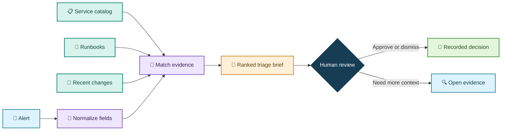
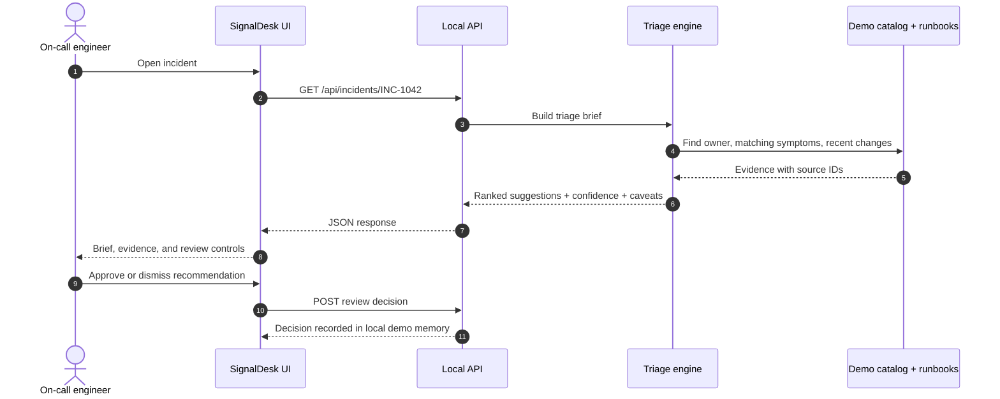
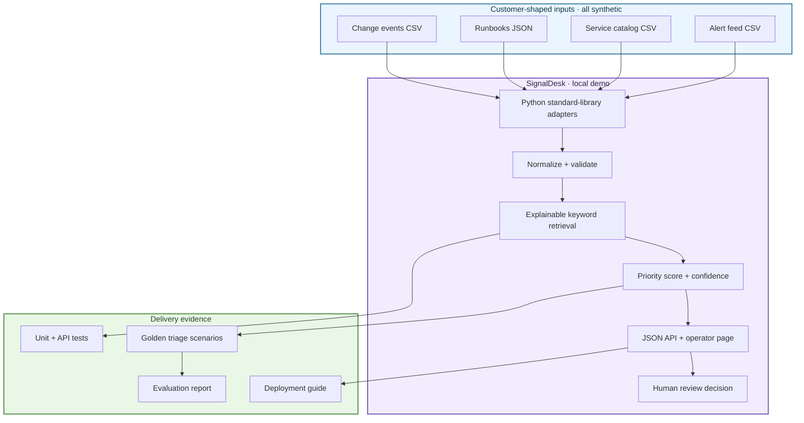
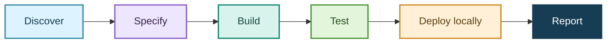

<div align="center">

# 🛰️ SignalDesk

### Incident triage that shows its work

**Turn a noisy alert into a clear next step—with evidence, confidence, and a human in control.**


</div>

> **In one sentence:** SignalDesk reads an alert, checks the service catalog and runbooks, then gives an on-call engineer an evidence-backed triage brief. It never changes a customer system by itself.

## 👀 The demo

An on-call engineer gets a spike alert at 02:14. Instead of searching three tabs, SignalDesk brings together the recent deploy, the service owner, and the matching runbook. It presents a ranked recommendation and the facts behind it. The engineer decides what to do next.



## ▶️ Run it in under a minute

Requires Python 3.11 or newer. There are no external packages, API keys, or cloud services to configure.

```bash
python3 -m signaldesk
```

Open **http://127.0.0.1:8000**. To try a specific example:

```bash
curl http://127.0.0.1:8000/api/incidents/INC-1042
curl http://127.0.0.1:8000/health
```

Run the test suite:

```bash
python3 -m unittest discover -s tests -v
```

## 🧭 What happens to an alert?



### Why this is useful

| Today’s pain | SignalDesk response |
| --- | --- |
| Alerts omit service context | Resolve service owner, tier, and dashboard from a small catalog |
| Runbooks are hard to find during an incident | Match symptoms and keywords; show matching terms and source references |
| Recent changes matter but live elsewhere | Surface a nearby synthetic deploy event as supporting evidence |
| Automated remediation is risky | Recommend only; a human review is required and recorded |
| Teams cannot tell if a helper is working | Include a small golden scenario set and measurable quality checks |

## 🧩 What is inside



## 🧪 Tests and what they prove

The included 13-check suite checks behavior, not just whether the server starts. It covers known incidents, missing data, evidence attribution, safety boundaries, review recording, and HTTP responses.

| Test area | Example check | Expected result |
| --- | --- | --- |
| Retrieval | Incident `INC-1042` matches the database-connection runbook | Matching runbook is ranked first and cited |
| Ownership | Incident is mapped to its service | Correct on-call team and tier are shown |
| Evidence | Every recommendation references source evidence | No unsupported action text is returned |
| Uncertainty | Unknown/weakly matched incident | Low confidence and “verify” guidance; no invented owner |
| Safety | Recommendation text asks for a risky action | The engine still only recommends; it cannot execute an action |
| Review | Engineer approves or dismisses a suggestion | Decision and timestamp are recorded in the demo process |
| API | Health, incident detail, missing incident, and review endpoints | Correct status codes and JSON shapes |
| Regression | Golden scenario expectations | Ranked runbook remains the expected first result |

See [`docs/testing.md`](docs/testing.md) for case IDs, observed results, and how to reproduce them. See [`docs/evaluation.md`](docs/evaluation.md) for the scoring method, measured results, and honest limitations.

## 🧑‍💼 Where a team could use it

- **SaaS on-call teams:** pull together alerts, service owners, deploys, and runbooks during a noisy incident.
- **Customer support operations:** triage recurring integration failures and surface the matching support playbook.
- **Internal IT service desks:** help route incoming incidents to the right team with linked evidence.
- **Data platform teams:** summarize pipeline freshness or job failures using catalog and runbook context.

These are fit-for-purpose examples, not claims of production validation. Connectors and permissions would need to be designed with each customer.

## 🛠️ Technology choices

- **Python 3.11+ standard library:** zero setup friction for a reviewer; WSGI HTTP server and JSON/CSV handling are built in.
- **Explainable retrieval:** a small transparent term-matching baseline keeps the demo deterministic and inspectable. A hosted LLM can be added behind an interface after a customer’s data boundary, quality target, and fallback behavior are understood.
- **Synthetic data:** examples are invented, so the repository contains no customer or production incident data.
- **Human approval boundary:** the prototype has no credentials or remediation connector; approvals are demo records only.

## 📦 Repository guide

| Path | What it contains |
| --- | --- |
| `docs/spec.md` | User needs, acceptance criteria, scope, and non-goals |
| `docs/design.md` | Architecture, data contracts, scoring, and security choices |
| `docs/research.md` | Job-posting sample, compensation context, and skills synthesis |
| `docs/testing.md` | Test cases with expected outcomes |
| `docs/evaluation.md` | Quality and performance measurement |
| `docs/final-report.md` | Hiring-manager-ready project summary and limitations |
| `data/` | Small, synthetic incident fixtures |
| `signaldesk/` | HTTP service, data adapters, and triage logic |
| `tests/` | Standard-library unit, integration, and regression tests |
| `Dockerfile` | Optional container run path |

## 🗺️ Delivery flow



## ⚠️ Scope and limitations

SignalDesk is a portfolio prototype. It does not connect to PagerDuty, Slack, Grafana, ticketing systems, or an LLM provider; it does not contain authentication, durable storage, tenancy controls, or real remediation. Never route production incidents or secrets through this demo. The evaluation uses a tiny synthetic dataset and should not be read as a production accuracy claim.

## 📚 Start here

1. Read [`docs/spec.md`](docs/spec.md) for what the user needs.
2. Read [`docs/design.md`](docs/design.md) for how the demo is structured.
3. Run it and click through the incidents.
4. Run the tests; compare the results in [`docs/evaluation.md`](docs/evaluation.md).
5. Read the [`final report`](docs/final-report.md) for delivery decisions and next steps.

---

<div align="center"><sub>Built as an FDE portfolio exercise · Synthetic data only · Human stays in control</sub></div>
