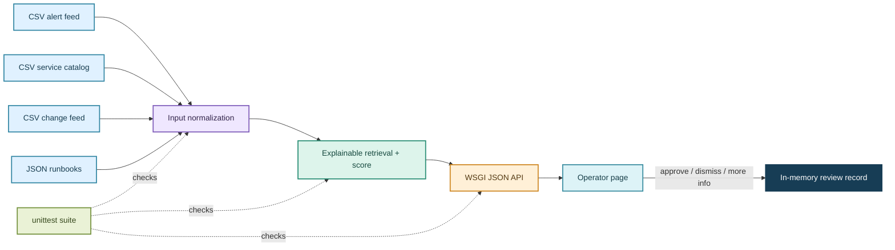

# Design notes

## System shape

## Data contracts

- `incidents.csv`: incident ID, service ID, title, severity, status, timestamp, description, and symptoms.
- `services.csv`: service ID, display name, owner team, tier, and dashboard URL.
- `changes.csv`: change ID, service ID, timestamp, and short summary.
- `runbooks.json`: runbook ID, title, summary, symptom strings, tags, and source path.
- API responses combine these into an incident summary, service owner, top three runbooks, matched terms, evidence cards, confidence label, and a read-only safety note.

All fixtures are synthetic. The `example.invalid` dashboard host intentionally cannot be mistaken for a real customer endpoint.

## Ranking logic

1. Tokenize the incident title, description, and symptom text.
2. Tokenize each runbook's title, summary, symptoms, and tags.
3. Score each candidate using `number of shared terms / number of query terms`.
4. Return up to three non-zero matches in descending score order.
5. Confidence is a simple calibrated-looking demonstration formula capped at 0.95. At or above 0.65 the UI suggests reviewing the linked runbook; otherwise it advises gathering more context.

This is deliberately simple, deterministic, and inspectable. The score is not a probability of correctness. A production system would use a customer-approved relevance metric, labeled examples, temporal evaluation, and a fallback policy before considering embeddings or an LLM.

## HTTP API

| Method and path | Purpose | Response |
| --- | --- | --- |
| `GET /health` | Liveness check | Service name, status, version |
| `GET /api/incidents` | List sample incidents | Summaries ordered by time |
| `GET /api/incidents/{id}` | Build a triage brief | Evidence, suggestions, confidence; `404` if unknown |
| `POST /api/incidents/{id}/review` | Record demo review | `approved`, `dismissed`, or `needs_more_info`; `201` if saved |
| `GET /api/reviews` | Inspect decisions in current process | In-memory records |

## Safety, privacy, and deployment boundary

- No network call leaves the local process, except when a developer explicitly runs a container image pull.
- No model key, user login, or production integration is included.
- No write connector or command execution path exists. Review is only a record of a human choice.
- Demo decisions are stored in process memory and disappear on restart.
- The server binds to `127.0.0.1` by default; a network-facing deployment needs authentication, authorization, TLS, audit retention, and a threat review.
- The app serves a static hand-written page and JSON from one origin; request data is HTML-escaped before rendering.

## Design decisions and tradeoffs

| Decision | Reason | Tradeoff |
| --- | --- | --- |
| Python standard library | Reviewer can run it without dependency setup | Not a production framework; less middleware and schema support |
| Deterministic keyword ranking | Every result is explainable and reproducible | Misses synonyms and semantic matches |
| Small CSV/JSON fixtures | Easy to inspect and replace with a real adapter | No streaming, schema registry, or freshness guarantee |
| Human approval only | A recommendation cannot alter customer systems | Does not demonstrate automation execution by design |
| In-memory review records | Keeps the demo stateless and safe | Decisions do not persist or support multiple users |

