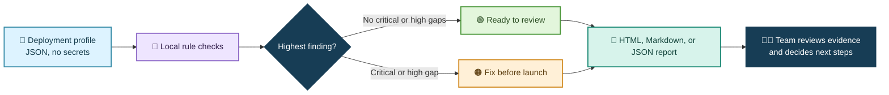
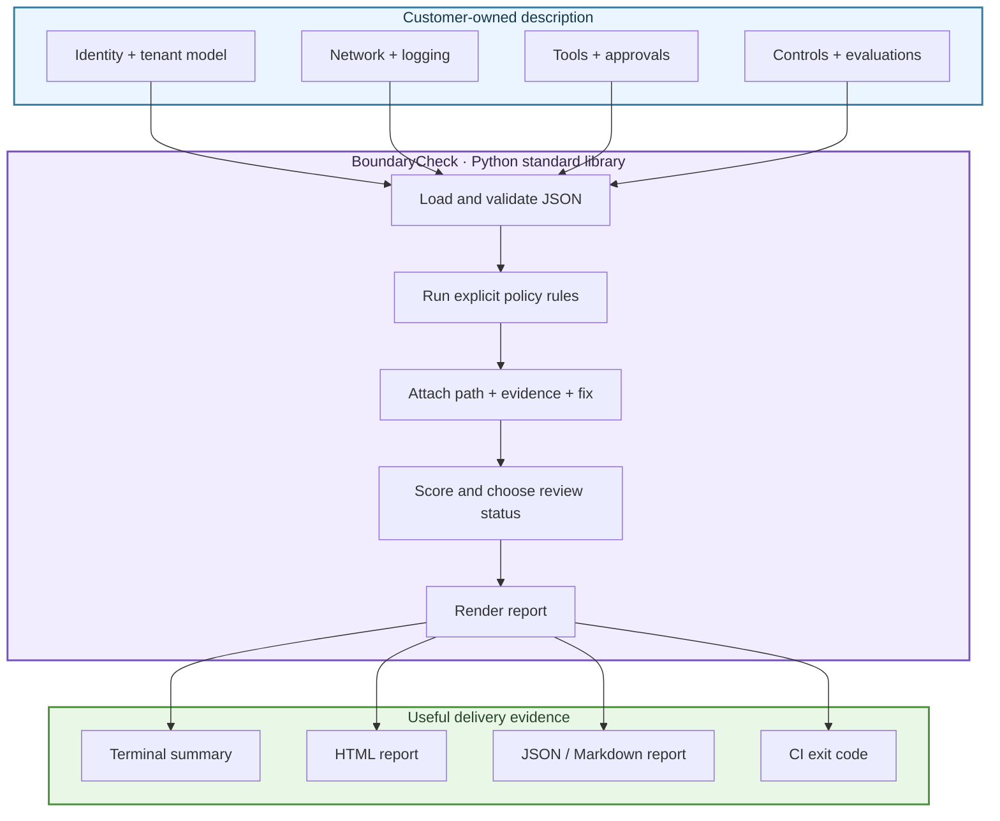

<div align="center">

# 🛡️ BoundaryCheck

### A calm, clear pre-launch review for AI deployments

**Spot risky deployment settings before a customer workflow goes live.**


</div>

> **In one sentence:** BoundaryCheck reads a small description of an AI deployment and turns security and launch-readiness gaps into a prioritized, evidence-linked checklist.

## 👋 Why this exists

An AI demo can work beautifully and still be unready for a real customer. For example, a support assistant might have broad network access, write to every customer's ticket queue, or keep sensitive prompts in logs. Those details are easy to miss when teams are racing to prove value.

BoundaryCheck makes those assumptions visible before launch. It is a small, local tool: no cloud account, external service, or API key is needed. It does not inspect a live system or certify compliance. It checks only the deployment profile you provide.

## ✨ Try it in two minutes

Requires Python 3.9 or newer. There are no third-party packages.

```bash
cd project-02-boundarycheck
python3 -m boundarycheck scan examples/retail-risky.json
```

That example is intentionally unsafe. BoundaryCheck prints a score, a launch decision, and findings with the exact profile path and a practical fix. Try a safer profile:

```bash
python3 -m boundarycheck scan examples/support-starter.json
python3 -m unittest discover -s tests -v
```

Save a report you can share with an engineer or project lead:

```bash
python3 -m boundarycheck scan examples/retail-risky.json \
  --format html --output reports/retail-review.html --fail-on critical
```

Open the generated HTML file in a browser. `--fail-on` also gives CI a useful exit code when a selected severity is present.

## 🧭 How it works



### The decision in plain language

| Result | Meaning | Suggested next move |
| --- | --- | --- |
| **BLOCKED** | At least one critical or high-risk setting needs attention | Fix it or document an owner-approved exception before launch |
| **REVIEW** | No critical/high finding, but moderate gaps may remain | Assign owners and agree on a launch plan |
| **READY TO REVIEW** | No configured rule found a critical/high issue | Have the customer security and operations owners review the evidence |

“Ready to review” is not a security certification or a claim that an application is safe. It means only that this version of the scanner did not find the listed issues in the supplied profile.

## 🧰 What the scanner checks

| Area | Example question | Example rule |
| --- | --- | --- |
| Identity | Does the deployment name an enterprise authentication method? | `BC001` flags missing or unsupported authentication |
| Tenant boundary | Can one customer's agent reach another customer's records? | `BC002` and `BC007` flag weak isolation and cross-tenant tools |
| Network | Is outbound access limited to named destinations? | `BC005` flags wildcard egress |
| Data handling | Are prompts retained, and are sensitive fields redacted? | `BC003` / `BC004` flag risky logging choices |
| Agent tools | Do write actions have narrow scope and human approval? | `BC006` / `BC007` flag excessive agency |
| Operations | Are TLS, audit events, secrets, and rollback considered? | `BC008`–`BC011` check launch controls |
| Evaluation | Is there a repeatable acceptance check before launch? | `BC012` / `BC013` check evaluation evidence |

Findings include a severity, a short explanation, a JSON path showing the evidence, and a suggested remediation. The rules are intentionally visible in [`boundarycheck/scanner.py`](boundarycheck/scanner.py).

## 🧪 What was tested

The 21 checks exercise safe and unsafe profiles, rule-by-rule behavior, malformed input, report escaping, stable JSON output, and the command-line failure threshold. The checked-in [test results](docs/testing.md) show the exact case IDs and observed outcomes.

| Example | Important expected result |
| --- | --- |
| Safe support assistant | No critical or high finding; launches as **READY TO REVIEW** |
| Retail assistant with all-tenant write tool | `BC007` is **CRITICAL**, with the offending tool path cited |
| Wildcard network destination | `BC005` is **HIGH**, recommending a named allowlist |
| Prompt text retained without redaction | `BC003` and `BC004` explain the privacy risk |
| Invalid JSON / wrong top-level type | Clear input error; no partial or misleading report |
| Text containing HTML characters | Escaped in the HTML report rather than rendered as markup |

See [`docs/testing.md`](docs/testing.md) for test IDs, [`docs/evaluation.md`](docs/evaluation.md) for the small synthetic evaluation, and [`docs/final-report.md`](docs/final-report.md) for the delivery summary and limitations.

## 🧑‍💼 Where a team could use it

- **Before a customer pilot:** turn assumptions about identity, data, tools, and egress into a review checklist.
- **In a pull request:** scan a deployment profile and fail CI if a critical or high finding appears.
- **During a customer security review:** generate a readable report that shows exactly what profile fields triggered each finding.
- **For a repeatable handoff:** compare the initial profile with the revised one and keep the findings as launch evidence.

The sample profiles are invented. A real team would first agree on its profile format, policies, exception process, and security owners.

## 🧱 Design in a picture



## 📁 Project guide

| File | What it is for |
| --- | --- |
| [`docs/spec.md`](docs/spec.md) | User problem, requirements, success measures, and scope |
| [`docs/design.md`](docs/design.md) | Data shape, rule engine, output design, and trade-offs |
| [`docs/research.md`](docs/research.md) | High-compensation FDE postings reviewed and skills synthesized |
| [`docs/threat-model.md`](docs/threat-model.md) | Trust boundaries, risks, safeguards, and limitations |
| [`docs/testing.md`](docs/testing.md) | Test plan, case list, command, and observed results |
| [`docs/evaluation.md`](docs/evaluation.md) | Synthetic benchmark and measured results |
| [`docs/final-report.md`](docs/final-report.md) | Final submission report, outcomes, and next steps |
| [`examples/`](examples/) | Safe and deliberately risky deployment profiles |
| [`reports/`](reports/) | Example generated output for the risky profile |

## 🎯 Why this is FDE-shaped

The research behind this project points to a role that owns a customer outcome from discovery through production and handoff. BoundaryCheck turns that idea into a concrete delivery: scoped requirements, an integration-shaped input, clear safety boundaries, a runnable tool, tests, evaluation evidence, and documentation a customer engineer can use. It also reflects the security depth and operational judgment that appear in the highest-compensation postings. See the [source-backed research notes](docs/research.md).

## ⚠️ Honest limits

- This is a profile linter, not a live cloud scanner, penetration test, compliance review, or security certification.
- A rule may be wrong for a particular customer. A qualified security owner must review policy and findings.
- The current rules are hand-written and finite; passing them cannot prove that a deployment is secure.
- The examples use no real customer data. Do not put secrets or sensitive production details in a profile.

---

*BoundaryCheck is a portfolio prototype. It demonstrates how to make launch risks legible; it is not an audit product.*
