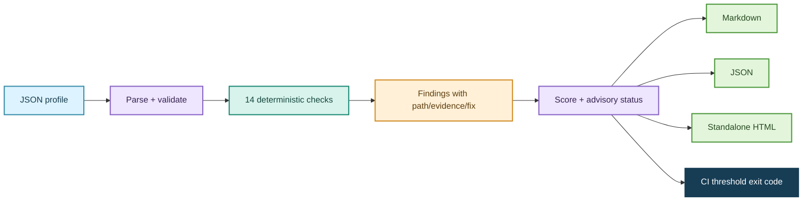

# Design notes

## Architecture

The project has three small layers: a scanner that owns policy checks and result shape, renderers that format that shape, and a CLI that handles file I/O and CI behavior. This makes the core easy to unit-test without shelling out or creating a server.

## Profile contract

Profiles contain `customer`, `deployment`, and `evaluation` objects. The deployment describes identity, egress, logging, controls, and tool permissions. Profiles intentionally contain references such as `secret_source: workload_identity`, never secret values. Missing security fields are treated as unconfirmed and can result in findings; missing optional customer labels get readable defaults.

## Rule behavior

Each rule has a stable `BCnnn` identifier and attaches its observed value to a dotted JSON path. Findings are sorted by severity, code, and path, so output is deterministic. The score starts at 100 and deducts fixed severity weights. The score is for prioritization only; the launch status derives from the highest severity, not from an arbitrary score cutoff.

| Severity | Score deduction | Default action |
| --- | ---: | --- |
| Critical | 25 | Block pending security-owner review |
| High | 15 | Block pending remediation or an approved exception |
| Medium | 8 | Assign an owner and due date |
| Low | 3 | Track as a follow-up |
| Info | 0 | Keep as context |

## Security and privacy choices

- Local file input and local report output only. The CLI has no network client.
- HTML fields are escaped before insertion into the report.
- The scanner does not print the whole profile, only values attached to findings.
- Sample data uses fictional names and `.example` destinations.
- Reports may themselves contain sensitive configuration evidence; teams should store them appropriately.

## Trade-offs

- **Small policy set vs. broad coverage:** a short explicit list is easy to inspect, but it will not catch unknown risks.
- **JSON profile vs. provider plugins:** JSON works across cloud vendors and is easy to review, but needs a customer-owned adapter to reflect real infrastructure.
- **Deterministic scanner vs. LLM reviewer:** deterministic checks are reproducible and avoid sending data externally; they do not reason about arbitrary architecture context.
- **Simple score vs. nuanced risk model:** the score helps triage but can hide important context, so each finding remains visible and status is based on severity.

## Extension points

A production follow-on could add a documented profile schema, rule packs with versioning, configuration diffs, signed CI artifacts, owner/expiry metadata for exceptions, and adapters that generate profiles from Terraform plans. Each adapter should remain read-only and be validated with customer-specific fixtures.
